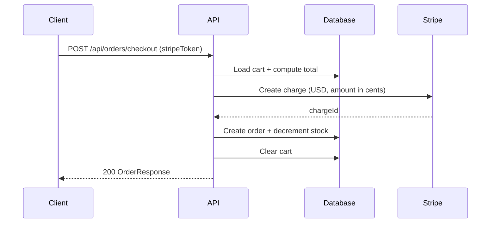

# ecommerce-api

E-Commerce REST API built with Spring Boot. Provides JWT-based authentication, a product catalog, shopping cart, order checkout, and Stripe payment integration.

## Features

- **Auth**: Register + login, returns a JWT (`Authorization: Bearer <token>`)
- **Product catalog**: Public read endpoints; admin-only create/update/delete
- **Cart**: Add/update/remove items, per-user cart
- **Orders**: Checkout cart → Stripe charge → order persistence + stock decrement
- **Validation + errors**: Jakarta validation for request DTOs, consistent JSON errors for domain failures

## Tech stack

- Java 17
- Spring Boot 3.4.4 (Web, Validation, Data JPA, Security)
- JWT: `io.jsonwebtoken` (JJWT)
- Database: PostgreSQL (runtime), H2 (tests)
- Payments: Stripe Java SDK

## Architecture

Layered flow:

`Controller → Service → Repository → Entity/DB`

Security boundary:

- Public: `/api/auth/**` and `GET /api/products/**`
- Auth required: everything else
- Admin-only: product write operations via method security (`@PreAuthorize("hasRole('ADMIN')")`)

## Configuration

Runtime configuration is in `src/main/resources/application.properties`.

Key properties:

- `spring.datasource.url`
- `spring.datasource.username`
- `spring.datasource.password`
- `app.jwt.secret` (must be **at least 32 characters** for HS256 key material)
- `app.jwt.expiration-ms` (token TTL in milliseconds)
- `stripe.api.key` (Stripe secret key)

Tests use `src/main/resources/application-test.properties` (H2 + test JWT secret + fake Stripe key).

## Run locally

Prerequisites:

- Java 17
- Maven
- PostgreSQL running locally (or update `spring.datasource.*` to point at your DB)

Run the API:

```bash
mvn spring-boot:run
```

Run with the test profile:

```bash
mvn spring-boot:run -Dspring-boot.run.profiles=test
```

Run tests:

```bash
mvn test -Dspring.profiles.active=test
```

## Authentication quickstart

Register:

```bash
curl -s -X POST http://localhost:8080/api/auth/register \
  -H "Content-Type: application/json" \
  -d '{"email":"user@example.com","password":"secret123","name":"User"}'
```

Login:

```bash
curl -s -X POST http://localhost:8080/api/auth/login \
  -H "Content-Type: application/json" \
  -d '{"email":"user@example.com","password":"secret123"}'
```

The response contains:

- `token`: JWT to pass as `Authorization: Bearer <token>`
- `email`
- `role` (`USER` or `ADMIN`)

### Admin role

There is no API endpoint to promote a user to `ADMIN`. To test admin-only product operations, update the user’s `role` in the database.

## Example flow

1. List products (public):

```bash
curl -s http://localhost:8080/api/products
```

2. Add item to cart (auth required):

```bash
TOKEN="<paste JWT here>"

curl -s -X POST http://localhost:8080/api/cart/items \
  -H "Authorization: Bearer ${TOKEN}" \
  -H "Content-Type: application/json" \
  -d '{"productId":1,"quantity":2}'
```

3. Checkout (auth required)

This API expects a Stripe _source token_ (in test mode you can use Stripe’s standard tokens such as `tok_visa`).

```bash
curl -s -X POST http://localhost:8080/api/orders/checkout \
  -H "Authorization: Bearer ${TOKEN}" \
  -H "Content-Type: application/json" \
  -d '{"stripeToken":"tok_visa"}'
```

## Error responses

Domain errors:

```json
{ "error": "..." }
```

Validation errors:

```json
{
  "errors": {
    "field": "validation message"
  }
}
```

Authentication failures are returned as HTTP `401` with a plain `Unauthorized` message from the security entry point.

## Stock behavior

Stock is decremented during checkout (not reserved when items are added to cart). The cart add endpoint checks stock for the requested add quantity.

## Checkout sequence



## API reference

See [docs/api.md](docs/api.md).
